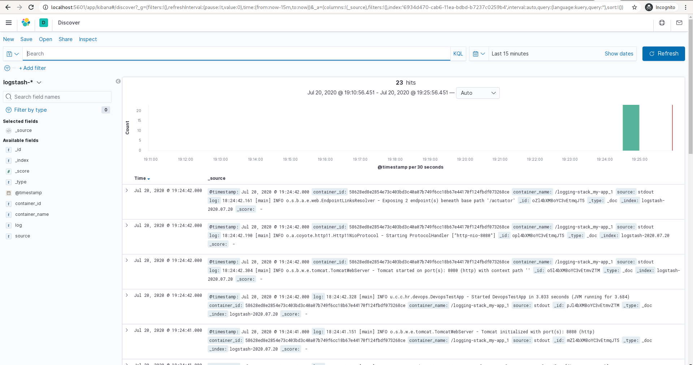

# Logging stack

Sample docker compose project for running environment locally with logging stack

# Running

```
$ docker-compose up -d --build
Building fluentbit
Step 1/2 : FROM fluent/fluent-bit:1.5.0
 ---> ca4e3177dc8e
Step 2/2 : ADD fluent-bit.conf /fluent-bit/etc/
 ---> Using cache
 ---> 3a04ab14f931
Successfully built 3a04ab14f931
Successfully tagged logging-stack_fluentbit:latest
Recreating logging-stack_fluentbit_1     ... done
Recreating logging-stack_elasticsearch_1 ... done
Recreating logging-stack_kibana_1        ... done
Recreating logging-stack_example_app_1   ... done
```

Kibana should then be accessible at http://localhost:5601/

Example UI:

